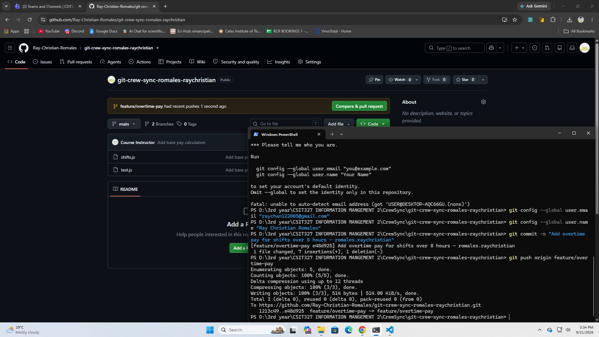
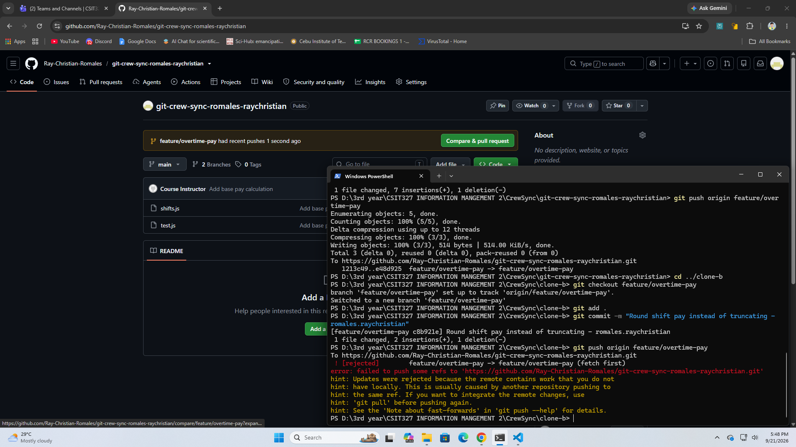
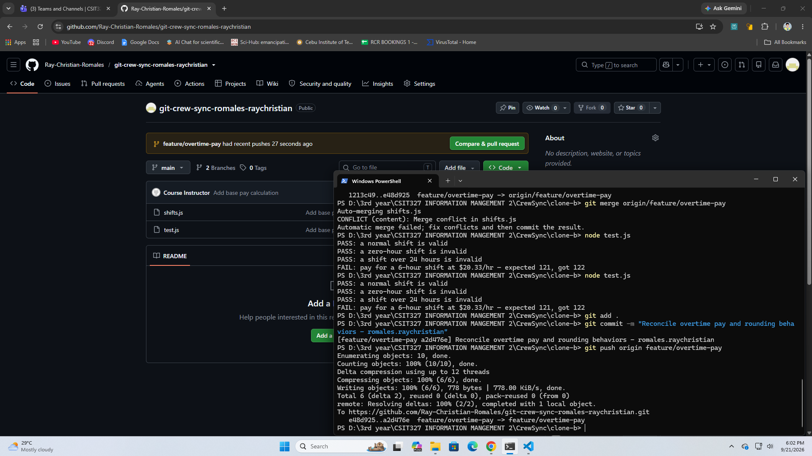
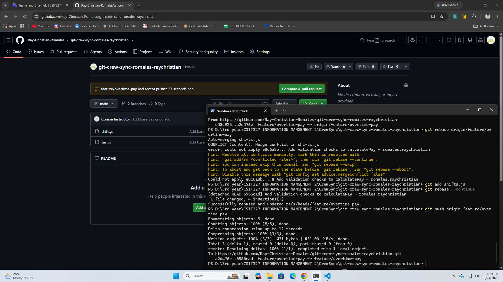
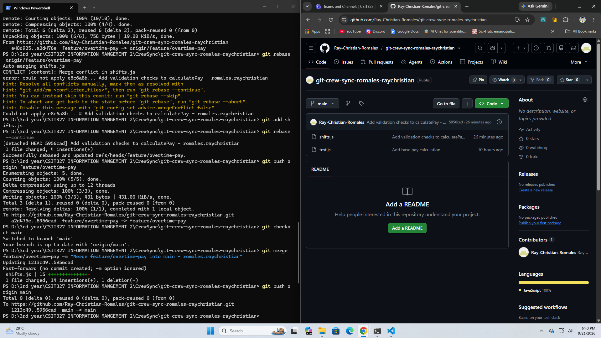
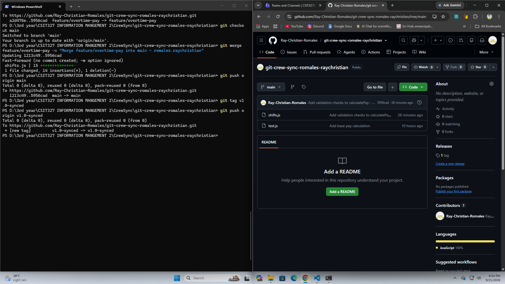

# Git Crew Sync Workflow Report

**Name:** Ray Christian C. Romales  
**Repository:** https://github.com/Ray-Christian-Romales/git-crew-sync-romales-raychristian.git

---

## Screenshot Evidence

### Task 1 Evidence: Successful Push from Clone A



### Task 2 Evidence: Rejected Push from Clone B



### Task 3 Evidence: Merge Conflict Resolution and Push



### Task 4 Evidence: Second Rejection, Rebase Conflict, and Push



### Task 5 Evidence: Main Branch Updated and Pushed



### Task 6 Evidence: Tag Created and Pushed



---

## Analysis & Written Answers

### 1. What did the rejected push error message tell you, and why did it happen?

The rejected push error message stated `! [rejected] - non-fast-forward` alongside a hint indicating that the remote repository contains commits that do not exist in the local branch.

This happened because git maintains branch integrity through linear or fast-forward commit histories by default. When Clone A pushed new commits to the remote `feature/overtime-pay` branch, the remote tip advanced. When Clone B attempted to push its independent commit without having fetched Clone A's updates, Git blocked the push to prevent Clone B from silently overwriting or losing the remote commits introduced by Clone A.

### 2. What's the actual difference between how you resolved Task 3 (merge) vs Task 4 (rebase)?

- **Task 3 (git merge):** Merging creates an explicit **merge commit** with two parent commits (one pointing to Clone B's local branch tip and the other pointing to `origin/feature/overtime-pay`). The branch history reflects true historical divergence where both lines of development coexist and tie together with a merge node.
- **Task 4 (git rebase):** Rebasing rewrites the local commit history. Instead of tying divergent branches together with a merge commit, Git temporarily stashes the local commit (`Add validation checks...`), pulls the remote commits to advance the local base tip, and then replays the local commit directly on top of the newly updated base. This results in a completely linear commit history with zero extra merge commits.

### 3. What one habit would have avoided both rejected pushes in this lab?

The single best habit to prevent non-fast-forward push rejections is to **always pull (or fetch and rebase) before starting new work and right before pushing**:

```bash
git pull --rebase origin <branch-name>
```
